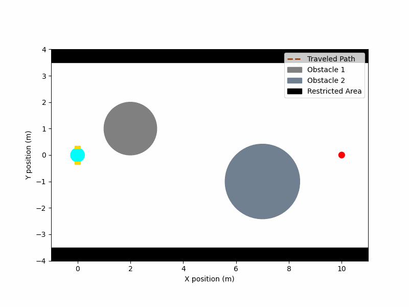

# Overview

This repository is initiated by the final project of **MECHENG 599 - Applied Optimal Control (2024 Fall)** at University of Michigan - Ann Arbor. Model predictive control (MPC) and control barrier function (CBF) are used for robot motion planning problem with obstacle avoidance. [The unicycle model](https://cooprobo.readthedocs.io/en/latest/mobile/pioneer/model/kinematics.html#the-unicycle-model) is used as robot dynamics. Code is tested in **Ubuntu** operating system and it is implemented in **Python 3.10**. **CasADi** is used as optimization solver.

Disclaimer: This is **NOT** a research project. Some part might not be rigorous and suggestions are welcomed.

**MPC-DC (N=25)**
<p align="center">
  
</p>

**MPC-CBF (N=25, γ = 0.8)**
<p align="center">
  
</p>


## Run Locally

Clone the project

```bash
  git clone https://github.com/lihanlian/motion-planning-mpc
```

Go to project directory
```bash
  python3 -m venv env && source env/bin/activate 
```
```bash
  pip install -r requirements.txt
```

 - config.py defines parameters including prediction horizion(N), total time steps, gamma (for CBF), etc.
 - run _main.py_ to simulate feedback control loop and store the state and control trajectories. 
 - run _visualization.py_ to get the animation.
 - Two methods are used: _mpc_dc_ and _mpc_cbf_. Choose one of them while running _main.py_ and _visualization.py_. Adjust corresponding parameters in _config.py_ if necessary.


## References
 - [Safety-Critical Model Predictive Control with Discrete-Time Control Barrier Function](https://hybrid-robotics.berkeley.edu/publications/ACC2021_MPC_CBF.pdf) (ACC 2021)
 - [106B Discussion: Control Barrier Functions](https://www.youtube.com/watch?v=G7OiBjlO07k&t=1506s)
 - [Jason Choi -- Introduction to Control Lyapunov Functions and Control Barrier Functions](https://www.youtube.com/watch?v=_Tkn_Hzo4AA&t=2392s)

## License

[MIT](./LICENSE)